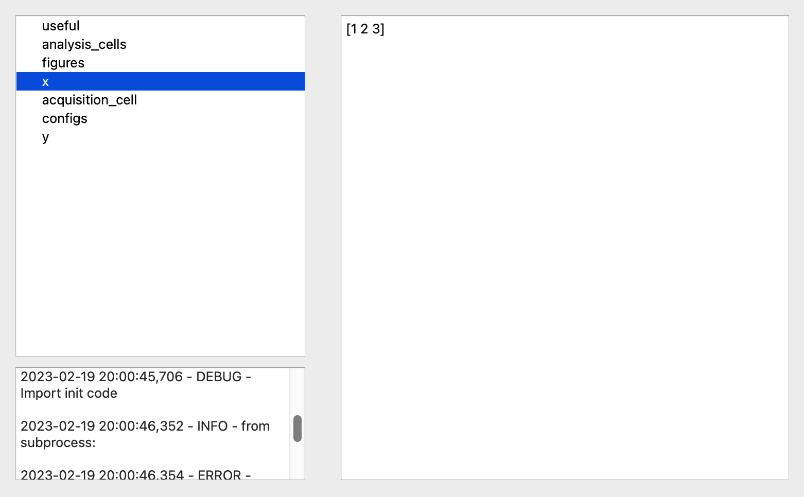
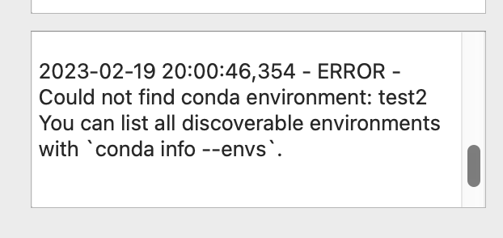

## Install

`pip install h5viewer`

or download the `exe` file from the last release.
It was tested on mac and windows.

## Usage
To open the viewer run `h5viewer` inside your cmd or run the executable file.

### Run analysis
By default, analyze code will be executed with `exec`, which means:
- if you started the window from cmd it'll execute from the same cmd
- if you started the window as an exe file, it'll execute inside the virtual environment of this exe file, where almost nothing installed

If you want to run an analysis inside the specific environment, you should specify it at the beginning of the `init_analyse.py` file (which should be in the same directory as your data file).

Example for Mac:
```python
# SOURCE: source ~/opt/anaconda3/bin/activate pyqt
```
Example for Windows:
```python
# SOURCE: C:\ProgramData\Anaconda3\Scripts\activate.bat&&conda activate pyqt
```

### How to run code before your analyze cell. `init_analyse.py`
If you want to set up any variables or imports before running the analysis_cell, you can do in by adding the `init_analyse.py` file in the same directory as the data file.

Example:
This is the classical file structure if you use `labmate` library:
- sample_001
    - analysis_code
        - analysis_script.py
    - data
        - experiment_1
            - init_analyse.py
            - data_file.h5

So you open `data_file.h5` and try to run the code inside it. But to do that you need `analysis_script.py`. So inside `init_analyse.py` you need to import it:
```python
from labmate.acquisition_notebook import AcquisitionAnalysisManager

SCRIPT_DIR = os.path.join(os.path.dirname(__file__), os.pardir)
sys.path.append(os.path.join(os.path.abspath(SCRIPT_DIR), 'analyse'))

meas_dir = os.path.split(os.path.split(SCRIPT_DIR)[0])[0]
aqm = AcquisitionAnalysisManager(meas_dir)

from init_analyse import *
```


### Error
Any error can be seen in the console view at the bottom right. Output from executing analysis_cell is also available there.



### Set up `AcquisitionAnalysisManager` to create `init_analyse.py` automatically
There is no need for you to create an `init_analyse.py` file in each directory.

You can set any file to be an `init_analyse.py` by providing it to `AcquisitionAnalysisManager`:
```python
aqm.set_init_analyse_file("some_init.py")
```


## Dev

### How to compile locally
Install pyinstaller
```bash
python -m pip install --upgrade pip
pip install setuptools wheel twine
pip install -r requirements.txt
pip install pyinstaller
```
Then run
`pyinstaller main.spec`
Depending on which system you are, it will create a program file for this system inside the `dist`

Note: there is no need to install the package with pip to compile it.

### Installation in dev mode

You can download the code, package it and install it in dev mode. It will allow you to change the code while using it.

`python setup.py bdist_wheel && pip install -e .`

or you can just run 

`python setup.py develop`
